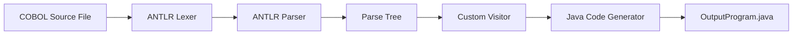
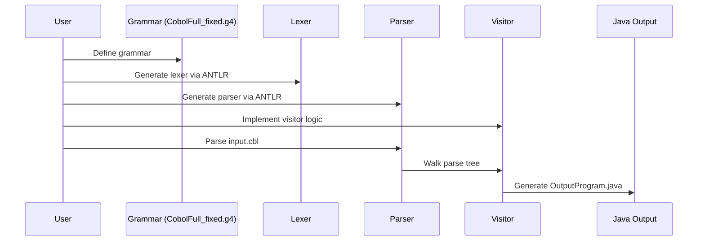

# COBOL to Java Translator (ANTLR‑Based)


---

## 🔥 Overview

This project demonstrates how a **COBOL program** can be modernized into **Java** using an ANTLR-driven parsing pipeline.

I have worked earlier on **enterprise-scale modernization tools** like **BlueAge**, **Heirloom**, and others. However, I wanted to experience the inner mechanics of modernization by **hand‑crafting the journey using ANTLR** — at least for a small COBOL program — and successfully generate Java code.

This repository contains:

* A simplified yet functional **COBOL grammar (ANTLR)**
* A **Lexer + Parser** generated using ANTLR
* A **Visitor-based Java code generator**
* A working **COBOL → Java translation workflow**

---

## 🛡️ Badges


---

## 📁 Repository Structure

```
COB-JAVA-NEW/
 ├── CobolFull_fixed.g4                # ANTLR Grammar
 ├── CobolFull_fixedLexer.java         # Generated Lexer
 ├── CobolFull_fixedParser.java        # Generated Parser
 ├── CobolFull_fixedBaseVisitor.java   # Visitor base
 ├── CobolToJavaVisitor.java           # Custom translator logic
 ├── CobolToJavaDriver.java            # Main entry point
 ├── input.cbl                          # COBOL sample program
 └── OutputProgram.java (generated)     # Java output
```

---

## 🧠 High-Level Architecture



---

## 🔁 Translator Pipeline Flow



---

## 🏗️ Steps to Build and Run

### **1. Install ANTLR JAR**

Place `antlr-4.13.1-complete.jar` in your project folder.

### **2. Generate Lexer + Parser**

```
java -jar antlr-4.13.1-complete.jar -visitor CobolFull_fixed.g4
```

### **3. Compile All Java Files**

```
javac -cp .;antlr-4.13.1-complete.jar *.java
```

> On Linux/Mac use `:` instead of `;`

### **4. Run Translator**

```
java -cp .;antlr-4.13.1-complete.jar CobolToJavaDriver
```

This produces:

```
OutputProgram.java
```

---

## 📸 Screenshots 


```

Example sections:

* ANTLR generation output
* Successful Java generation
* IDE view of files
* GitHub repository layout

---

## 🧩 Sample COBOL Program

```cobol
       IDENTIFICATION DIVISION.
       PROGRAM-ID. DEMO.

       DATA DIVISION.
       WORKING-STORAGE SECTION.
       01  A  PIC X.
       01  B  PIC X.

       PROCEDURE DIVISION.
           DISPLAY 'H'.
           ADD A TO B.
           STOP RUN.
```

---

## 🛠️ Generated Java Output (Sample)

```java
public class OutputProgram {
    public static void main(String[] args) {
        System.out.println("H");
        B = B + A;
    }
}
```

---

## 🤝 Contributing

Pull requests are welcome.

You can:

* Add more COBOL verbs
* Improve grammar
* Add more Java translation cases
* Extend support to files/IO/conditions

---

## 📜 License

This project is licensed under the **MIT License**.

---

## ⭐ Support

If this helped you understand ANTLR or COBOL modernization:
**Star the repository! ⭐**

---

## 🙌 Acknowledgements

* ANTLR by Terence Parr
* COBOL community & modernization experts

---

Happy Modernizing 🚀
